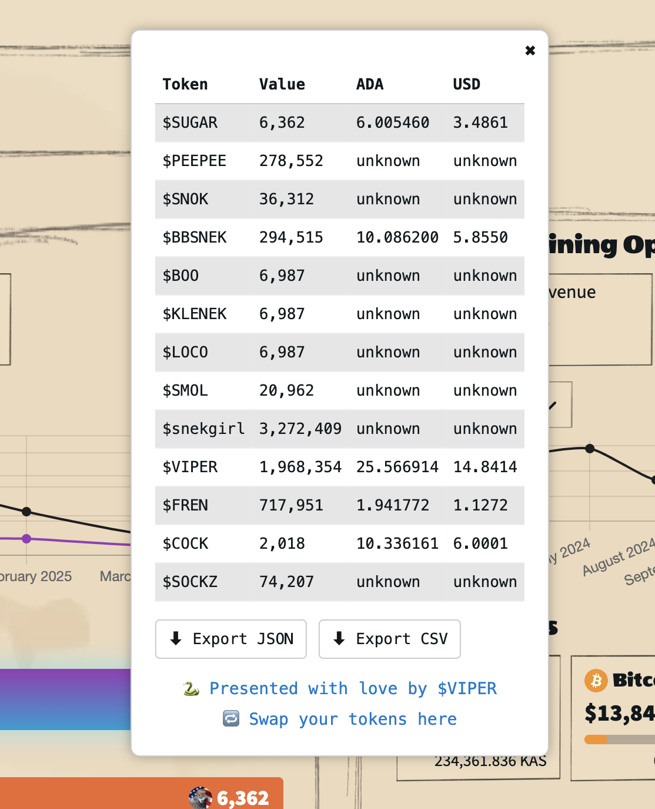

# SNEKKIES rewards calculated ADA and USD value
This script makes the value of the additional token rewards of SNEKKIES nft visible as a new Layer on the mining website. 

## Install
Go to https://snekkies.com/dashboard/mines and create a Bookmarklet loading the token-bookmarklet.js file of this repo:

```
javascript:(function(){  const script = document.createElement('script');  script.src = 'https://cdn.jsdelivr.net/gh/snekable/Snekkies-token-value-calculator/token-bookmarklet.js';  script.onload = () => console.log('Bookmarklet script loaded.');  document.body.appendChild(script);})();
```

Using this Bookmarklet creates now an overlay with ADA and USD informations

You can also export the overlay data as JSON OR CSV file



## ADA and USD data
The data are requested on the fly from [coingecko](https://www.coingecko.com/) - means also that only tokens can be calculated that are listed on coingecko.

## Attention
This script will never open or request a wallet transaction window! Be aware of scam and malware. Check my script to trust its functionality! 

## Miscellaneous
This script was made of a Cardano, $SNEK, SNEKKIES and $VIPER lover. Join these communities for more helpful content in the future.
